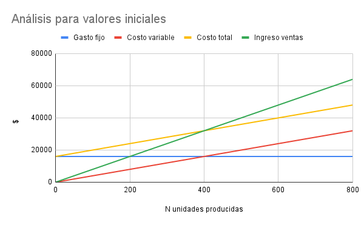
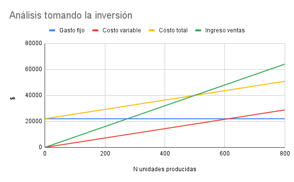

# Ejercicio 8.16

CANCIONES, SA. fabrica altavoces para equipos de audio con unos costes fijos de 16.000 euros,
un precio medio de venta de 80 euros y un coste medio variable de 40 euros.
La cada vez mayor sofistificación de los reproductores de sonido instalados en habitáculos reducidos
ha supuesto que este fabricante se plantee elaborar altavoces de menor tamaño,
con materiales especiales y diseños innovadores sin que ello afecta a la calidad de sonido.
Para conseguirlo, la empresa requeriría de tecnología de punta y debería incurrir en un coste fijo adicional de 6.000 euros,
reduciéndose un 10% el coste medio variable. 
A partir de la información suministrada responda a las siguientes cuestiones:

Para un volumen de producción de 800 unidades, analice la conveniencia o no de acometer
la inversión desde el enfoque del análisis de punto de equilibrio.
Si la empresa acometiera la inversión y quisiera aumentar los beneficios un 25%
¿Cuál debería ser el precio medio?

## Resolución
### Conveniencia o no de acometer la inversión

| Valores iniciales |                    |
|-------------------|--------------------|
| Gastos fijos      | Y = 16000          |
| Costo variable    | Y = 40 * X         |
| Costo total       | Y = 40 * X + 16000 |
| Ingreso ventas    | Y = 80 * X         |

Obtenemos algunos puntos para graficar.

| Gastos fijos |       | Costo variable |       | Costo total |       | Ingreso ventas |       |
|--------------|-------|----------------|-------|-------------|-------|----------------|-------|
| X            | Y     | X              | Y     | X           | Y     | X              | Y     |
|            0 | 16000 |              0 |     0 |           0 | 16000 |              0 |     0 |
|          800 | 16000 |            800 | 32000 |         800 | 48000 |            800 | 64000 |

Ahora se aumenta en 6000 el gasto fijo, se reduce un 10% el costo variable.

| Valores nuevos |                    |
|----------------|--------------------|
| Gastos fijos   | Y = 22000          |
| Costo variable | Y = 36 * X         |
| Costo total    | Y = 36 * X + 22000 |
| Ingreso ventas | Y = 80 * X         |

| Gastos fijos |       | Costo variable |       | Costo total |       | Ingreso ventas |       |
|--------------|-------|----------------|-------|-------------|-------|----------------|-------|
| X            | Y     | X              | Y     | X           | Y     | X              | Y     |
|            0 | 22000 |              0 |     0 |           0 | 22000 |              0 |     0 |
|          800 | 22000 |            800 | 28800 |         800 | 50800 |            800 | 64000 |

Analizando desde el punto de vista de equilibrio (PE), no conviene acometer la inversión, ya que para los valores iniciales se tiene 400 unidades como PE, mientras que con la
inversión se mueve a 500 unidades.
Este aumento de la cantidad de unidades necesarias para cubrir los costos aumentaria la zona de perdida.

### Se toma la inversión, ¿Cuál debería ser el precio medio?

Si la empresa toma la inversión y quiere aumentar los beneficios un 25%, puede producir mas o aumentar el precio (los costos ya estan determinados). Como el enunciado pregunta sobre el precio, vemos aumentandolo.
Vemos cual es el beneficio que se obtiene, esto se puede ver en el gráfico tambien. Es la diferencia entre el ingreso de ventas y los costos totales.

Beneficio = 64000 - 50800 = 13200

| Beneficio | %   |
|-----------|-----|
|     13200 | 100 |
|      3300 |  25 |

Se deben obtener $3.300 más.

Se producirían 800 unidades, obteniendo un total de $64.000 + $3.300 = $67.300 
Por lo que el precio debería de ser $67.300/800 = $84,125

