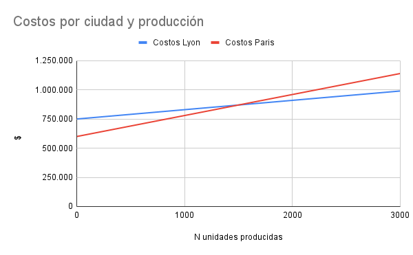

# Ejercicio 2

Una empresa francesa dedicada al reciclaje de cartón está buscando un lugar apropiado para crear una nueva planta de tratamiento de residuos.
Para tomar la decisión ha analizado los costes (en euros) que supondría la instalación de dos lugares diferentes, tal y como se detalla a continuación.
¿Para qué niveles de producción es más interesante cada una de las localizaciones? Para un tratamiento de 3000 unidades, ¿qué localización resulta más adecuada?

|                         | Lyon    | Paris   |
|-------------------------|---------|---------|
| Costo fijo              | 750.000 | 600.000 |
| Costo variable (unidad) |      80 |     180 |

## Resolución
### ¿Para qué niveles de producción es más interesante cada una de las localizaciones? 

Paris va a convenir incialmente, mientras que se tenga un costo inferior al de Lyon.

| Lyon  | Y= 80 * X + 750.000  |
|-------|----------------------|
| Paris | Y= 180 * X + 600.000 |

| Lyon |         | Paris |         |
|------|---------|-------|---------|
| X    | Y       | X     | Y       |
|    0 | 750.000 |     0 | 600.000 |
| 3000 | 990.000 |  3000 | 1140000 |

Se puede ver que Paris va a convenir mientras que se produzcan menos de 1500 unidades,
mientras que Lyon si la cantidad es mayor.

### Para un tratamiento de 3000 unidades

Como ya se vio arriba, conviene Lyon.

|                                 | Lyon    | Paris     |
|---------------------------------|---------|-----------|
| Costo fijo                      | 750.000 |   600.000 |
| Costo variable (3.000 unidades) |  240000 |    540000 |
| Total                           | 990.000 | 1.140.000 |
